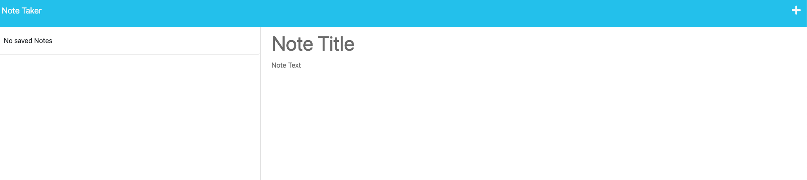

# note-taker

## Description
This application allows the user to write, store, delete and review notes.  The application came with starter code for the front end.  I built the html and API routes so that they are linked to the backend server and communicating with the db.json file. All of the notes saved by the user are saved as a JSON.  You will notice the the the GET, POST, and DELETE methods are used to achieve this. 

## Installation
  

## Usage
Heroku URL:

## License
No License